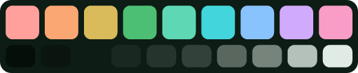
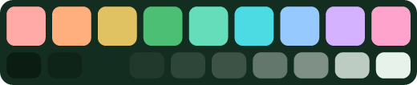
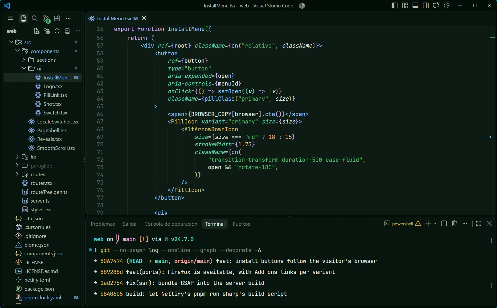
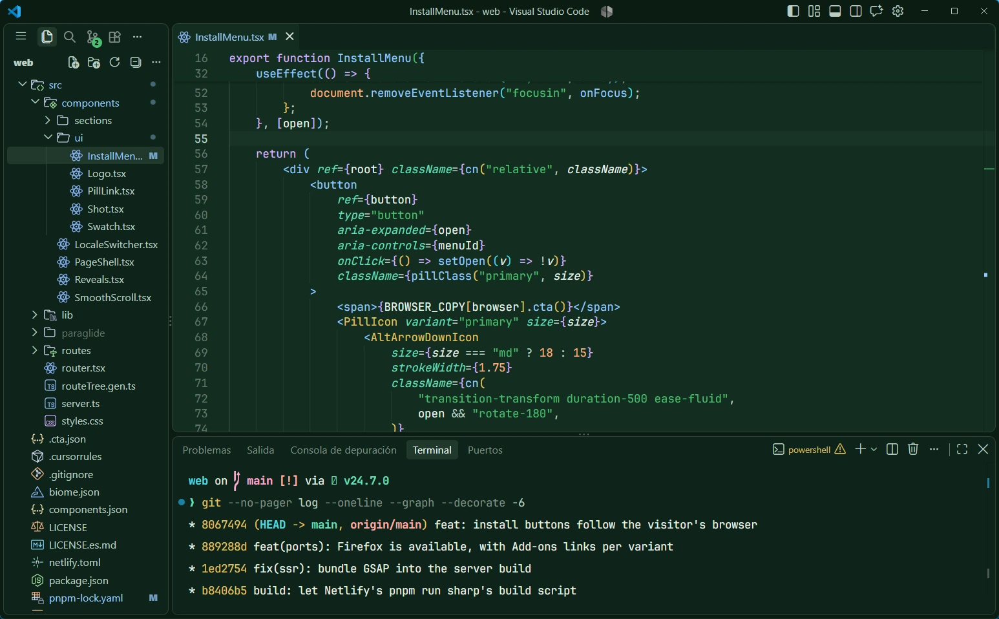
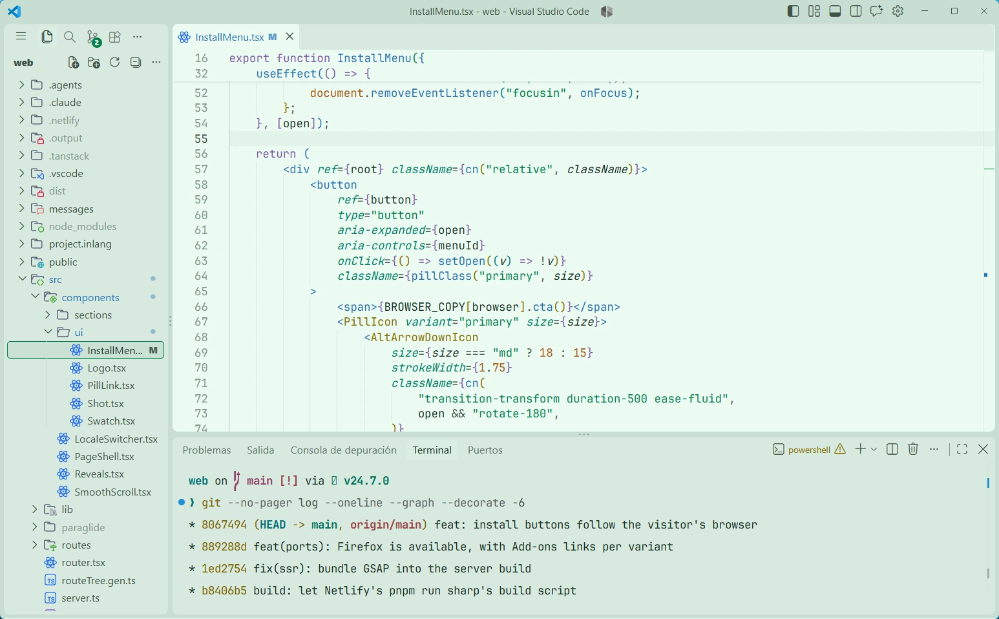

<div align="center">


# Nephrite for VS Code

**English** · [Español](README.es.md)

A calm, jade-inspired theme for [Visual Studio Code](https://code.visualstudio.com), in three flavors.

[](LICENSE)
[](https://github.com/Nephrite-theme/palette)

</div>

## Flavors

| Flavor | Colors | For |
| --- | --- | --- |
| **Nephrite Forest** |  | Deep and dark, for late nights |
| **Nephrite Jade** |  | Dark with more green, for long days |
| **Nephrite Mint** |  | Light and airy, for daylight |

## Previews







## Install

1. Open the **Extensions** view (`Ctrl+Shift+X`, or `Cmd+Shift+X` on macOS).
2. Search for **Nephrite** and click **Install**.
3. Open the theme picker with `Ctrl+K Ctrl+T` (`Cmd+K Cmd+T`) and choose a flavor.

Using VSCodium, Cursor or another editor based on VS Code? Nephrite is also published on [Open VSX](https://open-vsx.org).

### Manually

Download the `.vsix` from the [releases](https://github.com/Nephrite-theme/vscode/releases), then run **Extensions: Install from VSIX...** from the command palette.

## What's themed

- **The whole workbench:** editor, tabs, side bar, activity bar, panels, menus, notifications, diff and merge views, and source control.
- **Syntax highlighting** by role, following the [palette's porting guide](https://github.com/Nephrite-theme/palette#building-a-port): keywords in amethyst, strings in jade, functions in sapphire, types in citrine, numbers in carnelian, properties in lagoon.
- **Semantic highlighting** for languages that support it, such as TypeScript, Python and Rust.
- **The integrated terminal**, with all 16 ANSI colors from the palette.

Every text color keeps at least 4.4:1 contrast against its background.

## Customizing

Override any color in your `settings.json` for one flavor only:

```jsonc
"workbench.colorCustomizations": {
  "[Nephrite Forest]": {
    "editor.lineHighlightBackground": "#19282080"
  }
}
```

## Development

The themes in `themes/` are generated, so don't edit them by hand. To pick up palette changes:

```sh
npm run sync    # download the latest palette.json
npm run build   # regenerate the three themes
```

Press `F5` in VS Code to open an Extension Development Host with the themes loaded. To package and publish:

```sh
npm run package                 # builds and creates nephrite-<version>.vsix
npx @vscode/vsce publish        # VS Code Marketplace
npx ovsx publish *.vsix         # Open VSX
```

Node 18 or newer, no dependencies.

## Contributing

Found a color that clashes, low contrast or a language that looks off? [Open an issue](https://github.com/Nephrite-theme/vscode/issues/new/choose) with a screenshot and the language. For how Nephrite ports are built and reviewed, see the [contributing guide](https://github.com/Nephrite-theme/.github/blob/main/CONTRIBUTING.md).

## Thanks

Created and maintained by [@ingfranciscastillo](https://github.com/ingfranciscastillo). Contributors will be listed here as the community grows.

## More Nephrite

Nephrite is also available for Chrome and Firefox. See every app at [getnephrite.dev/ports](https://getnephrite.dev/ports).
